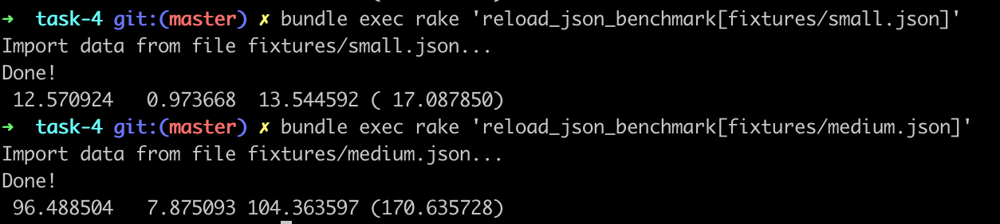
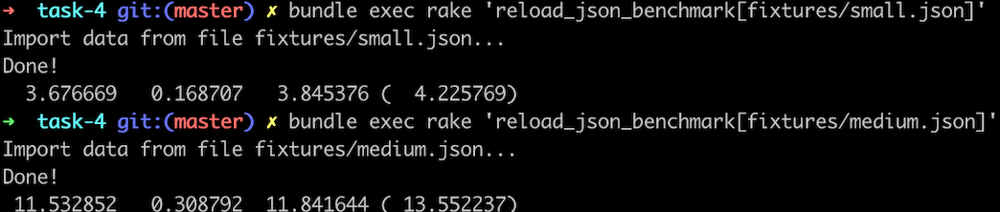
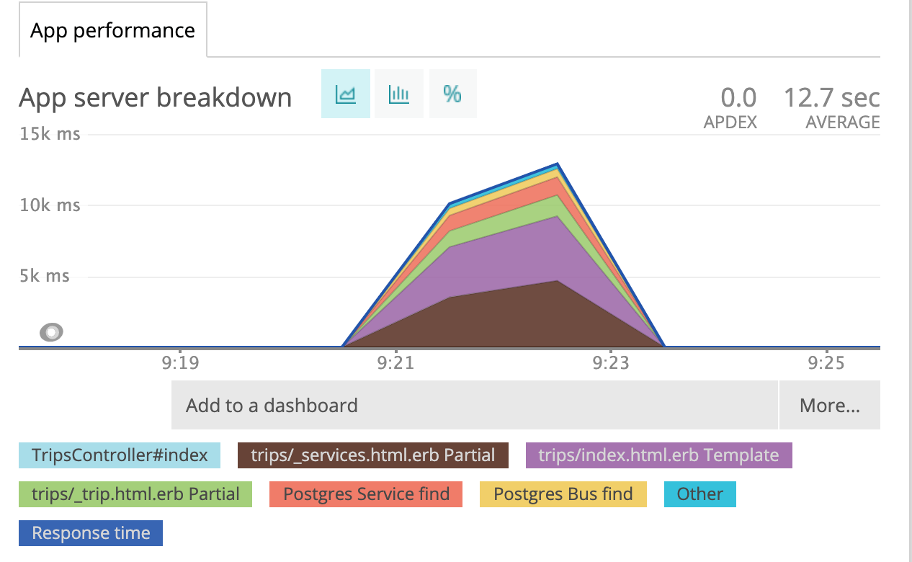
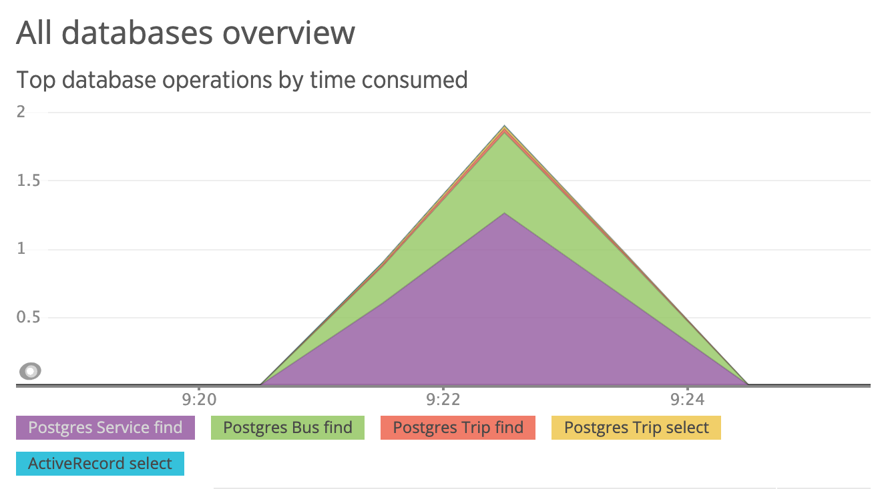
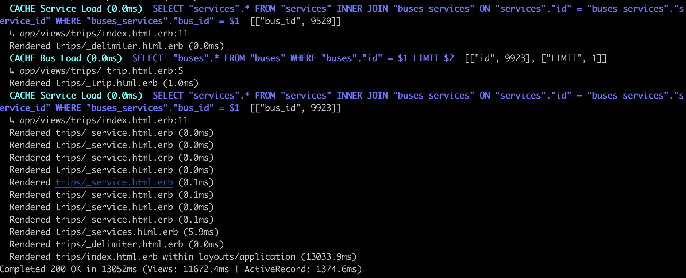

#  Optimization of loading large json files into database as well as rendering web pages speed with the given amount of data.

## Main goal is:

  - Optimize program to load large.json file within one minute.
  - Figure out how we can render schedule pages faster

## Tools I used to solve the problem:

  - gem pghero
  - newrelic
  - gem activerecord-import
  - gem strong_migrations
  - benchmark
  - apache benchmark testing
  
## 1. Optimization of data import

### Workflow

  - desided to start with `small.json` in order to increase feedback loop
  - extracted logic from rake tasks in it's own service so that it's easier to test.
  - wrote test for loading `.json` files
  - by implementing any changes on database level I made sure tests are passing and my benchmark metrics show better results

### Optimization 

  - I decided to insert records not one by one, but in bulk (for this I used gem activercord-import). I accumulate model instances in hashes. This allows quickly       access the required instance by key, as well as avoid duplicate records. As a result, all imports are done in four inserts.
  - I used Oj gem for parsing json.
  
### Results

#### Let\'s look at `Benchmark.measure` numbers showing the following:

- CPU time 
- system CPU time
- the sum of the user and system CPU time
- the elapsed real time. The unit of time is seconds.

#### Initial results of running `bundle exec rake 'reload_json_benchmark[fixtures/small.json]'` and `bundle exec rake 'reload_json_benchmark[fixtures/medium.json]'`:



#### Results  of running `be rake 'reload_json_benchmark[fixtures/small.json]'` after optimization and using `gem oj`, `gem activerecord-import`:



#### This improvement allowed me to load `fixtures/large.json` file with the following metrics:


## 2. Page load optimization 

### Workflow

- I added a test that checks the response from the problematic endpoint in order to prevent logic changes.

- To assess the effectiveness of the changes, I used apache benchmark tools (10 requests with concurrency 1). The measurements were made on the basis that was imported from the small.json file.

- To find bottlenecks I used Newrelic, rails console and gem pghero

### Optimization

Rendering the page turned out to be the most time-consuming, as can be clearly seen from the graph:



- First, I removed the unnecessary splitting into partial 's, since it has no value, but it slows down document generation.

- Second, I replaced rendering of partials in a loop with rendering of a collection.

The problem of N + 1 Query is clearly to see in the newrelic report and from rails: the bus and services associations are called for each request from the view.




We can use eager_load and call all related records with one request. So, it makes one query for each request, but a more complex one, including joining tables.

### Results

#### Apache benchmark

1. With indicies but without front end optimization

```
ab -n 10 -c 1 http://localhost:3000/автобусы/Самара/Москва

Server Software:
Server Hostname:        localhost
Server Port:            3000

Document Path:          /автобусы/Самара/Москва
Document Length:        538780 bytes

Concurrency Level:      1
Time taken for tests:   247.233 seconds
Complete requests:      10
Failed requests:        0
Total transferred:      5395342 bytes
HTML transferred:       5387800 bytes
Requests per second:    0.04 [#/sec] (mean)
Time per request:       24723.295 [ms] (mean)
Time per request:       24723.295 [ms] (mean, across all concurrent requests)
Transfer rate:          21.31 [Kbytes/sec] received

Connection Times (ms)
              min  mean[+/-sd] median   max
Connect:        0    0   0.0      0       0
Processing: 22301 24723 948.8  25043   25566
Waiting:    22300 24723 948.9  25043   25566
Total:      22301 24723 948.8  25043   25566

Percentage of the requests served within a certain time (ms)
  50%  25043
  66%  25186
  75%  25199
  80%  25265
  90%  25566
  95%  25566
  98%  25566
  99%  25566
 100%  25566 (longest request)
 ````


2. After removing partials and adding collections

```
ab -n 10 -c 1  http://localhost:3000/автобусы/Самара/Москва

Server Software:
Server Hostname:        localhost
Server Port:            3000

Document Path:          /автобусы/Самара/Москва
Document Length:        569667 bytes

Concurrency Level:      1
Time taken for tests:   45.169 seconds
Complete requests:      10
Failed requests:        0
Total transferred:      5704204 bytes
HTML transferred:       5696670 bytes
Requests per second:    0.22 [#/sec] (mean)
Time per request:       4516.931 [ms] (mean)
Time per request:       4516.931 [ms] (mean, across all concurrent requests)
Transfer rate:          123.33 [Kbytes/sec] received

Connection Times (ms)
              min  mean[+/-sd] median   max
Connect:        0    0   0.0      0       0
Processing:  3838 4517 448.1   4523    5575
Waiting:     3838 4516 448.1   4522    5575
Total:       3838 4517 448.1   4523    5575

Percentage of the requests served within a certain time (ms)
  50%   4523
  66%   4573
  75%   4583
  80%   4725
  90%   5575
  95%   5575
  98%   5575
  99%   5575
 100%   5575 (longest request)
 ````

As we can see from the results above after getting rid of partials and rendering partial with collection

- Time taken for tests reduced from 247.233 seconds to  45.169 seconds
- Time per request reduced from 24723.295 [ms] (mean) to 4516.931 [ms] (mean)
- Requests per second increased from 0.04 [#/sec] to 0.22 [#/sec] (mean)